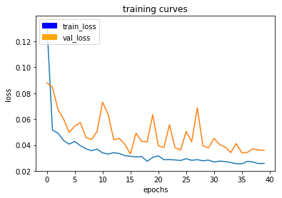

[](https://www.udacity.com/robotics)

# Project : Deep Learning Follow Me

## Writeup by Mustafa_eldeeb
## Mar 2020
## [Rubric](https://review.udacity.com/#!/rubrics/1155/view) Points
<p align="center">  </p>
In this project we will train a fully convolutional (FCN) deep neural network to identify and track a target in simulation. So-called “follow me” applications like this are key to many fields of robotics and the very same techniques you apply here could be extended to scenarios like advanced cruise control in autonomous vehicles or human-robot collaboration in industry.

### Fully Convolutional Networks

FCNs doesn't have any dense fully connected layers. all of its layers are convolutional layers.
FCNs, instead of using fully connected layers at the end, use convolutional layers to classify each pixel in an image.So the final output
layer will be the same height and width as the input image, but the number of channels will be equal to the number of classes.
FCNs comprises of mainly 3 parts: an encoder, a 1x1 convolution and a decoder.
The 1x1 convolution has small height and width but much bigger depth due to the use of filters in the preceeding encoder part.
The 1x1 convolution's height and width will be the same as the layer preceeding it.
The 1x1 convolution acts as a fully connected layer and retains spatial information of all the pixels.
The decoder is built up of layers of transposed convolutions whose outputs increase the height and width of the input while decreasing it's depth.
Skip connections allow the network to retain information from prior layers that were lost in subsequent convolution layers.

For this project I've chosen a model with 2 encoder layers, the 1x1 convolution, and then 2 decoder layers.
```
    # TODO Add Encoder Blocks. 
    conv1 = encoder_block(input_layer=inputs, filters=32, strides=2)
    conv2 = encoder_block(input_layer=conv1, filters=64, strides=2)

    # TODO Add 1x1 Convolution layer using conv2d_batchnorm().
    conv_norm = conv2d_batchnorm(input_layer=conv2, filters=128, kernel_size=1, strides=1)
    # TODO: Add the same number of Decoder Blocks as the number of Encoder Blocks
    deconv1 = decoder_block(small_ip_layer=conv_norm, large_ip_layer=conv1, filters=64)
    deconv2 = decoder_block(small_ip_layer=deconv1, large_ip_layer=inputs, filters=32)
    x = deconv2
    # The function returns the output layer of your model. "x" is the final layer obtained from the last decoder_block()
    return layers.Conv2D(num_classes, 1, activation='softmax', padding='same')(x)
```
### Training data

I have used a simple training dataset that has been provided in this project's repository. you can generate more data using the simulator. Additional training data will improve the score. 

### Hyperparameters

batch_size: number of training samples/images that get propagated through the network in a single pass.
num_epochs: number of times the entire training dataset gets propagated through the network.
steps_per_epoch: number of batches of training images that go through the network in 1 epoch. We have provided you with a default value. One recommended value to try would be based on the total number of images in training dataset divided by the batch_size.
validation_steps: number of batches of validation images that go through the network in 1 epoch. This is similar to steps_per_epoch, except validation_steps is for the validation dataset. We have provided you with a default value for this as well.
workers: maximum number of processes to spin up. This can affect your training speed and is dependent on your hardware. We have provided a recommended value to work with.

For this project I've chosen these values:
```
learning_rate = 0.01
batch_size = 20
num_epochs = 40
steps_per_epoch = 200
validation_steps = 50
workers = 8

```
At last epoch :
<p>  </p>
```
200/200 [==============================] - 50s - loss: 0.0258 - val_loss: 0.0358
```

### Prediction

To evaluate how well the FCN model is doing under different conditions. We will be using three different predictions available from the helper code provided and data provided (as mentioned above in data gathering section):

Below is taken from one of the test trainings runs.

### following_images:
Test how well the network can identify the target while following them.

Images while following the target:

<p align="center">  </p>
<p align="center">  </p>
<p align="center">  </p>

### Scores for while the quad is following behind the target. 
```
number of validation samples intersection over the union evaulated on 542
average intersection over union for background is 0.9943948430469736
average intersection over union for other people is 0.310806854943432
average intersection over union for the hero is 0.8816242294927692
number true positives: 539, number false positives: 0, number false negatives: 0
```

### patrol_non_targ:
Test how often the network makes a mistake and identifies the wrong person as the target.

Images while at patrol without target:

<p align="center">  </p>
<p align="center">  </p>
<p align="center">  </p>

### Scores for images while the quad is on patrol and the target is not visible
```
number of validation samples intersection over the union evaulated on 270
average intersection over union for background is 0.9816616331671117
average intersection over union for other people is 0.6149705311739785
average intersection over union for the hero is 0.0
number true positives: 0, number false positives: 123, number false negatives: 0
```

### patrol_with_targ: 
Test how well the network can detect the hero from a distance.

Images while at patrol with target:

<p align="center">  </p>
<p align="center">  </p>
<p align="center">  </p>

### This score measures how well the neural network can detect the target from far away
```
number of validation samples intersection over the union evaulated on 322
average intersection over union for background is 0.9956473827327774
average intersection over union for other people is 0.4017302180820972
average intersection over union for the hero is 0.23879964022914965
number true positives: 161, number false positives: 7, number false negatives: 140

```

### Evaluation

We will be using the IoU to calculate the final score. **IoU** is Intersection over Union, where the Intersection set is an **AND** operation (pixels that are truly part of a class AND are classified as part of the class by the network) and the Union is an **OR** operation (pixels that are truly part of that class + pixels that are classified as part of that class by the network).

<p align="center">  </p>

Sum all the true positives, etc from the three datasets to get a weight for the score: **0.7216494845360825**

The IoU for the dataset that never includes the hero is excluded from grading: **0.560211934861**

The Final Grade Score is the pixel wise:

```
average_IoU*(n_true_positive/(n_true_positive+n_false_positive+n_false_negative))
```

So the score is: **0.404276654023**


# Testing Model in the Simulator

I have selected the best model from the above mentioned and copied it to the code folder, started the simulator, then ran the following command to test the model in simulator:

```bash
$ python3 follower.py --pred_viz model_weights
```

# Can we use the same model to track other objects ?

The answer is yes, all what we need is to change the mask data and train again on the new target then use the same network to track  the new object. Network architecture will not change when there is change in target or size of input data. however we need to change the architecture if we wanted add more meanings such as (object distance from camera) or when we want to improve performance of network (such as adding more layers).


# Future Enhancements

* Recording a bigger dataset capturing more angles/distances of the target will help in further improving the network accuracy.

* Adding more layers will also help in capturing more contexts and improve accuracy of segmentation.

* Changing learning rate can also be helpful in reducing learning time.

* Adding skip connections can improve results but up to a certain number of connections only based on number of layers that we have.


